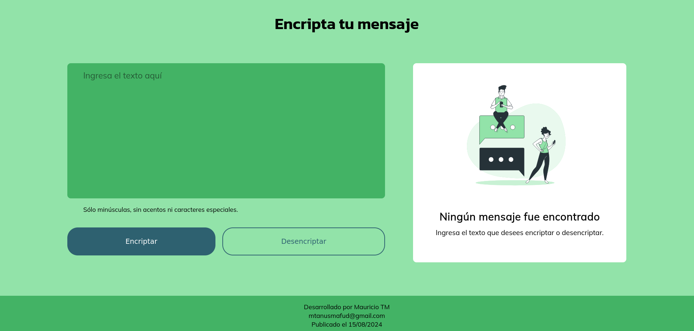

# Desafío: Encriptador de texto

## Descripción
Este desafío fue propuesto en los cursos de Alura Latam y Oracle Next Education (ONE). Es una aplicación capaz de encriptar y desencriptar textos. Así podremos intercambiar mensajes secretos con otras personas que sepan las *llaves* o *claves* de la encriptación utilizada.

Las *llaves* de encriptación empleadas son las siguientes:
* La letra *e* es convertida en *enter*
* La letra *i* es convertida en *imes*
* La letra *a* es convertida en *ai*
* La letra *o* es convertida en *ober*
* La letra *u* es convertida en *ufat*

Por ejemplo, al encriptar la palabra amigo obtenemos:

  *amigo* => *aimimesgober*

Y al desencriptarla:

  *aimimesgober* => *amigo*

## Requisitos
La aplicación sólo funciona con letras minúsculas, ñ y algunos signos de puntuación (como la coma y el punto). No deben ser utilizados letras con acentos ni caracteres especiales.

## Caso de uso
Para usar la app, debemos escribir un texto en el área destinada para ello. Luego podemos encriptar o desencriptar el mensaje empleando los botones para tal funcionalidades. Al hacerlo, el mensaje encriptado o desencriptado se mostrará en el panel anexo. Este panel cuenta con un botón para copiar el texto al portapapeles y así luego poder pegarlo en la aplicación o en el editor de texto que queramos.

Podemos compartir la aplicación a nuestros amigos y amigas, para poder intercambiar mensajes secretos, mediante el siguiente [link a la app](https://mtanus.github.io/encriptador-de-texto/)

## Tecnologías utilizadas
Para desarrollar la aplicación se emplearon las siguientes tecnologías:
* HTML5
* CSS3
* JavaScript

